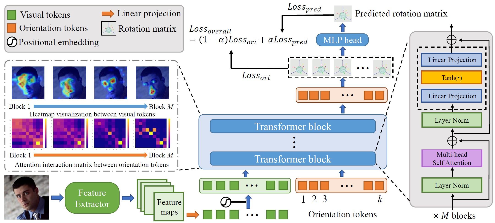

# [CVPR2023] TokenHPE: Learning Orientation Tokens for Efficient Head Pose Estimation via Transformers


This repository is an official implementation of [TokenHPE](https://openaccess.thecvf.com/content/CVPR2023/html/Zhang_TokenHPE_Learning_Orientation_Tokens_for_Efficient_Head_Pose_Estimation_via_CVPR_2023_paper.html).

## Overview

<div align="center">
  
</div><br/>
We propose  a novel critical minority relationship-aware method based on the Transformer architecture in which the facial part relationships can be learned. Specifically, we design several orientation tokens to explicitly encode the basic orientation regions. Meanwhile, a novel token guide multi-loss function is designed to guide the orientation tokens as they learn the desired regional similarities and relationships.

##  Preparation

### Environments  
  python == 3.9, torch >= 1.10.1, CUDA ==11.2

### Datasets  

Follow the [6DRepnet](https://github.com/thohemp/6DRepNet) to prepare the datasets:

* **300W-LP**, **AFLW2000** from [here](http://www.cbsr.ia.ac.cn/users/xiangyuzhu/projects/3DDFA/main.htm).

* **BIWI** (Biwi Kinect Head Pose Database) from [here](https://icu.ee.ethz.ch/research/datsets.html). 

Store them in the *datasets* directory.

For 300W-LP and AFLW2000 we need to create a *filenamelist*. 
```
python create_filename_list.py --root_dir datasets/300W_LP
```
The BIWI datasets needs be preprocessed by a face detector to cut out the faces from the images. You can use the script provided [here](https://github.com/shamangary/FSA-Net/blob/master/data/TYY_create_db_biwi.py). For 7:3 splitting of the BIWI dataset you can use the equivalent script [here](https://github.com/shamangary/FSA-Net/blob/master/data/TYY_create_db_biwi_70_30.py). The cropped image size is set to *256*.

### Download weights 
Download trained weights from [gdrive](https://drive.google.com/file/d/1bqfJs4mvQd4jQELsj3utEEeS6SDzW30_/view?usp=sharing)
You can choose to use the pretrained ViT-B/16 [weigthts](https://github.com/rwightman/pytorch-image-models/releases/download/v0.1-vitjx/jx_vit_base_patch16_224_in21k-e5005f0a.pth) for the feature extractor. (optional) 

### Directory structure
* After preparation, you will be able to see the following directory structure: 
  ```
  TokenHPE
  ├── datasets
  │   ├── 300W_LP
  │     ├── files.txt
  │     ├── ...
  │   ├── AFLW2000 
  │     ├── files.txt
  │     ├── ... 
  │   ├── ...
  ├── weights
  │   ├── TokenHPEv1-ViTB-224_224-lyr3.tar
  ├── figs
  ├── create_filename_list.py
  ├── datasets.py
  ├── README.md
  ├── ...
  ```
## Training & Evaluation

Download trained weight from [gdrive](https://drive.google.com/file/d/1bqfJs4mvQd4jQELsj3utEEeS6SDzW30_/view?usp=sharing), then you can evaluate the model following:

```sh
python test.py  --batch_size 64 \
                --dataset ALFW2000 \
                --data_dir datasets/AFLW2000 \
                --filename_list datasets/AFLW2000/files.txt \
                --model_path ./weights/TokenHPEv1-ViTB-224_224-lyr3.tar \
                --show_viz False 
```
You can train the model following:

```sh
python train.py --batch_size 64 \
                --num_epochs 60 \
                --lr 0.00001 \
                --dataset Pose_300W_LP \
                --data_dir datasets/300W_LP \
                --filename_list datasets/300W_LP/files.txt
```

## Inference & Visualization
You can get the visualizations following:
```sh
python inference.py  --model_path ./weights/TokenHPEv1-ViTB-224_224-lyr3.tar \
                     --image_path img_path_here
```
## Main results


We provide some results on AFLW2000 with models trained on 300W_LP. These models are trained on one TITAN V GPU. 

|          config          | MAE  | VMAE | training |   download |
|:------------------------:|:----:|:----:|:--------:|:-------------:|
| TokenHPEv1-ViT/B-224*224-lyr3 | 4.81 | 6.09 | ~24hours |   [gdrive](https://drive.google.com/file/d/1bqfJs4mvQd4jQELsj3utEEeS6SDzW30_/view?usp=sharing)     |


## **Acknowledgement**
Many thanks to the authors of [6DRepnet](https://github.com/thohemp/6DRepNet). We reuse their code for data preprocessing and evaluation which greatly reduced redundant work.

## **Citation**

If you find our work useful, please cite the paper:

```
@InProceedings{Zhang_2023_CVPR,
    author    = {Zhang, Cheng and Liu, Hai and Deng, Yongjian and Xie, Bochen and Li, Youfu},
    title     = {TokenHPE: Learning Orientation Tokens for Efficient Head Pose Estimation via Transformers},
    booktitle = {Proceedings of the IEEE/CVF Conference on Computer Vision and Pattern Recognition (CVPR)},
    month     = {June},
    year      = {2023},
    pages     = {8897-8906}
}
```
